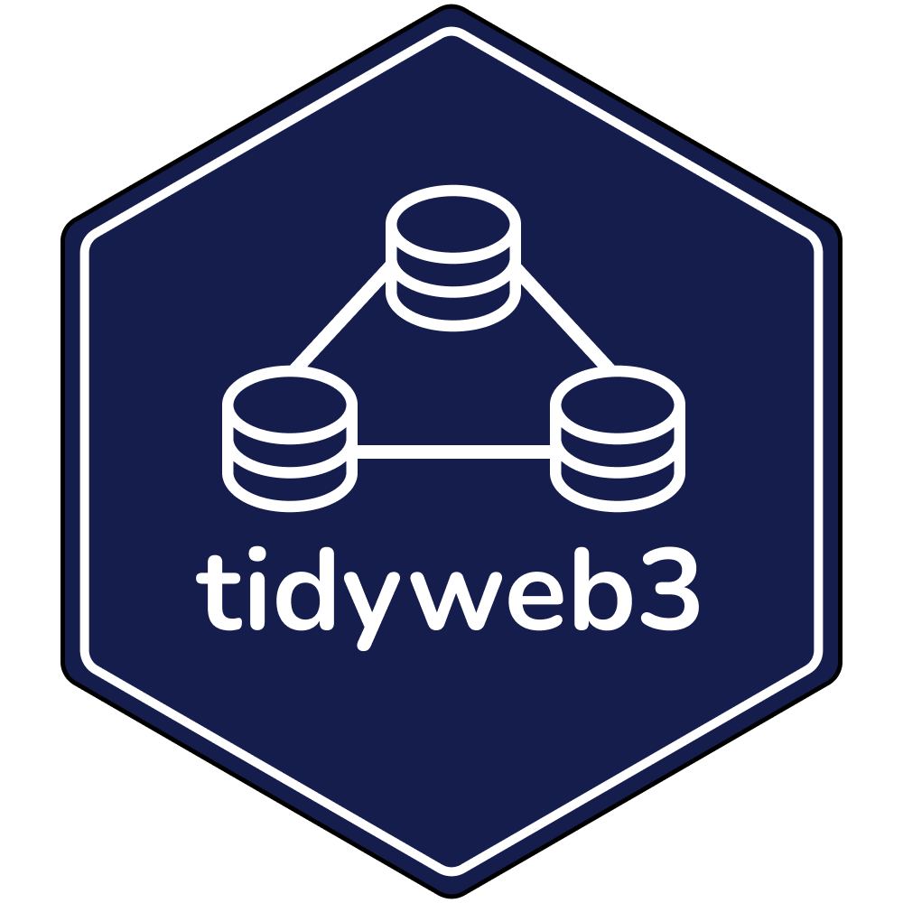

# tidyweb3 <br>

<!-- badges: start -->

[](https://github.com/tidyverse/ggplot2/actions/workflows/R-CMD-check.yaml)
[](https://app.codecov.io/gh/brandonleekramer/tidyweb3?branch=main)
[](https://cran.r-project.org/package=ggplot2)
<!-- badges: end -->

## Overview

tidyweb3 is package for accessing blockchain and web3 data in R

**Authors:** [Brandon Kramer](https://www.brandonleekramer.com/)<br/>
**License:** [MIT](https://opensource.org/licenses/MIT)<br/>

## Installation

You can install the development version of tidyweb3 from
[GitHub](https://github.com/) with:

``` r
# install.packages("devtools")
devtools::install_github("brandonleekramer/tidyweb3")
```

## Example

This is a basic example which shows you how to solve a common problem:

``` r
library(tidyweb3)
## basic example code
```

What is special about using `README.Rmd` instead of just `README.md`?
You can include R chunks like so:

``` r
summary(cars)
#>      speed           dist       
#>  Min.   : 4.0   Min.   :  2.00  
#>  1st Qu.:12.0   1st Qu.: 26.00  
#>  Median :15.0   Median : 36.00  
#>  Mean   :15.4   Mean   : 42.98  
#>  3rd Qu.:19.0   3rd Qu.: 56.00  
#>  Max.   :25.0   Max.   :120.00
```

You’ll still need to render `README.Rmd` regularly, to keep `README.md`
up-to-date. `devtools::build_readme()` is handy for this.
